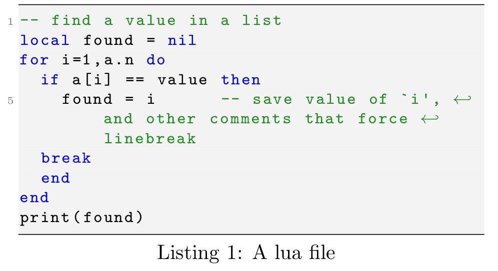
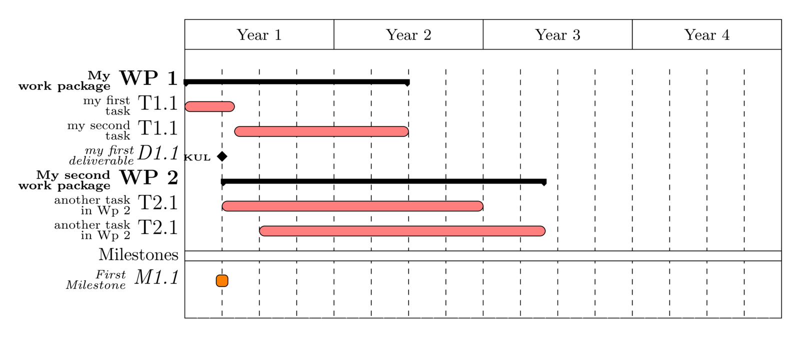

# Latex tips and tricks
To view on-line go to [ https://gborghesan.github.io/latex_notes](https://gborghesan.github.io/latex_notes)

## In-line enumeration
To save space, it is usegful to make a enumered list in the form of _i)_ , _ii)_, etc.
for doing so, I define the following environment:
```tex
% packages for inline lists
\usepackage{paralist}
\newenvironment{inparlist}{\begin{inparaenum}[\itshape i)]}{\end{inparaenum}}
```
The usage is the same of _itemize_ environment.

## Inclusion of figures ("The Easy Way")

This is for figures that have been maede in inkscape; there are 2 options:

One option is to save directly from inkscape as tex (`LaTeX with PSTricks extensions`) and include the files.


Another option is to save as pdf, with the text saved as latex, as show in the following figure.


see also [this page](https://tex.stackexchange.com/questions/151232/exporting-from-inkscape-to-latex-via-tikz).

This is by far the easiest; note that the `\includesvg` command uses the same command of inkscape but directly from shell.

In this kind of figure, latex code can be written directly in figures, see the This code is largely taken from [InkscapePDFLaTeX](http://tug.ctan.org/info/svg-inkscape/InkscapePDFLaTeX.pdf) documentation.


## Inclusion of figures ("Complex and Automatic")

I use mainly two types of figures

- svg files made in inkscape
- eps files made in matlab

for both, I use psfrag commands to have all the text in figure uniform.
psfrag is a comman that allows to substitute a string in a eps figure with another one. THe main advantage is the it is possible to control the type of charater and size will not scale by scaling the figure. in addittion math formulas can be inserted in the figure.
See [psfrag documentation](https://ctan.org/pkg/psfrag?lang=en) for more info.

### Preamble
in the preable, I add the following:

```tex
%\newcommand{\REFRESHFIGURES}{} % uncomment this to regenerate the figures
\ifdefined\REFRESHFIGURES
\usepackage{auto-pst-pdf} %this one is for eps 
\newcommand{\executeiffilenewer}[3]{
 \ifnum\pdfstrcmp{\pdffilemoddate{#1}}
 {\pdffilemoddate{#2}}>0
 {\immediate\write18{#3}}\fi
}

\newcommand{\includesvg}[1]{
 \executeiffilenewer{images/#1.svg}{images/#1.pdf}
 {inkscape -z -D --file=images/#1.svg 
 --export-area-page 
 --export-pdf=images/#1.pdf --export-latex}
 \input{images/#1.pdf_tex}
}
\else
\usepackage[off]{auto-pst-pdf}

\newcommand{\includesvg}[1]{
 \input{images/#1.pdf_tex}
 } 
\fi
```
The figure are generated only if the  `\REFRESHFIGURES` is defined.
The eps files must be in _images_ sub-deirectory
This code is largely taken from [InkscapePDFLaTeX](http://tug.ctan.org/info/svg-inkscape/InkscapePDFLaTeX.pdf)
also check there how to make the svgs.

**important**

- Tested in ubuntu
- pdflatex is used for compiling
- pdf latex needs to call inkscape so
  - inkscape must be istalled
  - pdflatex must be called with the *-shell-escape* flag, e.g.:
```bash
pdflatex -shell-escape main.tex
```


### Adding an svg figure
in the text, to add a figure, the following code can be use
```tex
\begin{figure}\centering
  	\def\svgwidth{\columnwidth}
  	\includesvg{figure_file}
\caption{\label{fig:figure1} A nice caption.}
\end{figure}
```
additionals psfrag commands can be used, before the `includesvg` command.

### Adding an eps figure
this I do mainly for matlab-generated graphs, but can be useful also for schemes generated with [Dia](https://sourceforge.net/projects/dia-installer/)

Following examples insert two subfigures (and needs also `\usepackage{subfig}` in the preamble)
```latex
\begin{figure}
\centering
\include{macro_psfrag}
\subfloat[caption of subfig 1 \label{fig:fig1_subfig1}]{
  \psfragfig[width=0.3892\columnwidth]{filename_subfig1}
}
\hfill
\subfloat[caption of subfig 2 \label{fig:fig1_subfig2}]{
   \psfragfig[width= 0.56 \columnwidth]{filename_subfig2}
}
\caption{Main caption of the figure \label{fig:main_figure}}
\end{figure}
```
The command `\psfragfig` is part of the pstool package. it automatically generates a pdf files that contains all the images, with the text already in there. is quite handy also for figure reuse.

Have a look to the [main1.tex](examples/main1.tex) file fo a minimally working example.


## References
Instead of putting the type of reference before the `\ref` command, e.g. `Fig.~\ref{fig:myfig}`, I use the package _cleveref_ . This package gives the command `\cref{}`, that automatically recognises the type of reference adding the type. in case the reference need to have the first letter capitalised, the command `\Cref` is also available.
If the default behaviuor is not of (e.g. you what _Fig. 1_ in place of _Figure 1_ in the text)it is possible to define the behaviuor.
```tex
\usepackage{cleveref}
\crefformat{equation}{(#2#1#3)}
\crefformat{section}{Sec.~#2#1#3}
\crefformat{figure}{Fig.~#2#1#3}
\crefformat{paragraph}{par.~#2#1#3}
\crefformat{lstlisting}{Listing~#2#1#3}
\crefmultiformat{lstlisting}{Listings~#2#1#3}%
{ and~#2#1#3}{, #2#1#3}{ and~#2#1#3} 
```
the last line specify what to do two or more listings (will be on that in a moment) are present.
look at the [package documentation](http://tug.ctan.org/tex-archive/macros/latex/contrib/cleveref/cleveref.pdf), sincethe package has many more options.

## Source Codeand other code snippets
To snippets of code in latex, I use the package _listings_
it has already some syntax higlight done for some languages.if you need to define your language (syntax higlighting) and the way it is presented (listing style), this is possible in the preable:
```tex

\usepackage{listings}
\usepackage{textcomp}
\definecolor{dkgreen}{rgb}{0,0.6,0}
\definecolor{gray}{rgb}{0.5,0.5,0.5}
\definecolor{mauve}{rgb}{0.58,0,0.82}
\lstdefinelanguage{lua}
  {morekeywords={and,break,do,else,elseif,end,false,for,function,if,in,local,
     nil,not,or,repeat,return,then,true,until,while},
     sensitive=true,
   morecomment=[l]{--},
   morecomment=[s]{--[[}{]]--},
   morestring=[b]",
   morestring=[d]'
  }
\lstdefinestyle{luastyle}
{
	numbers=left,
	stepnumber=5,    
	firstnumber=1,
	keywordstyle=\color{blue},
	numberfirstline=true,
	numbersep=2pt, % how far the line-numbers are from the code 
	numberstyle=\tiny\color{gray}, % the style that is used for the line-numbers
	xleftmargin=5pt,%framexleftmargin=5mm,
	language=lua,
	inputencoding=utf8x,
	backgroundcolor=\color[rgb]{0.95,0.95,0.95},
	tabsize=2,
	rulecolor=,
	basicstyle=\footnotesize \ttfamily,
	upquote=true,
	aboveskip={1.0\baselineskip},
	columns=fixed,
	showstringspaces=false,
	extendedchars=true,
	breaklines=true,
	prebreak = \raisebox{0ex}[0ex][0ex]{\ensuremath{\hookleftarrow}},
	frame=lines,
	showtabs=false,
	showspaces=false,
	showstringspaces=false,
	identifierstyle=\ttfamily,
	commentstyle=\color[rgb]{0.133,0.545,0.133},
	stringstyle=\color[rgb]{0.627,0.126,0.941},
	captionpos=b,
}  

\lstnewenvironment{luaenv}[1][]{ 
	\lstset{ 
		label=#1,
 		style=luastyle}}{}

```
The code above is in a file ([listing_def.tex](examples/listing_def.lua)) that is included in the preable.

Then, to add a snippet of code in the tex document from a separate lua file:
```
\lstinputlisting[style=luastyle,float,caption={caption of the listing},label=listing: point]{file.lua}
```
The result looks like this:




The package has many possible options,to be checked in the [documentation](https://ctan.org/pkg/listings?lang=en).

## Gantt charts
Practically the only way i found to make these kind of charts, is tu use the _pgfgantt_ package.
An example is in the [main_gantt.tex](examples/main_gantt.tex)


to generate an image from the tex, I have a bash script with the following
```bash
lualatex main_gantt.tex
pdfcrop --margins 10 main_gantt.pdf main_gantt_crop.pdf
convert -geometry 1600x1600 -density 800x800 -quality 100 main_gantt_crop.pdf main_gantt.png
``` 
lualatex is need if the extra font is used.

the result looks like the following



## Define new commands for words that are used often
The _xspace_ commands taks care that a space is added after a word, only if it is not a comma or a point.
in the preamble:
```tex
\usepackage{xspace}
\newcommand{\eg}{\textit{e.g.}\xspace}
```

## Make a pdf with track changes, w.r.t. the last commit in git
To see which are the latest changes in a latex document, sometimes work the command ```latexdiff```
for example, to see the changes of the latest commit and build with latexmk, use:

```bash
git latexdiff HEAD~1 --latexmk
```
To see the changes that are not committed vs. the latest commit:

```bash
git latexdiff HEAD --
```
